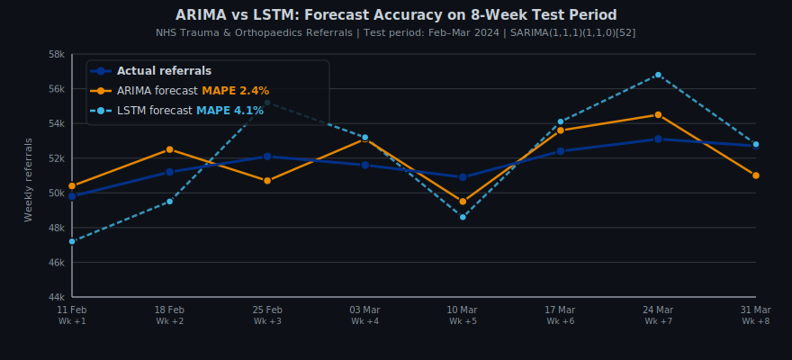

# NHS Referral Demand Forecasting

[](https://python.org)
[]()
[]()
[]()
[]()

> Forecasting NHS outpatient referral volumes 4--8 weeks ahead to support workforce and capacity planning.

---

## Business Question

> "Can outpatient referral demand be predicted 4--8 weeks ahead to support NHS workforce and capacity planning in outpatient services?"

Every week, NHS trusts receive thousands of GP referrals for outpatient appointments. Without reliable demand forecasts, capacity planners are forced to react to backlogs rather than anticipate them. This leads to preventable breaches of the 18-week Referral to Treatment (RTT) target and inefficient use of clinical staff.

This project uses NHS England's publicly available Referral to Treatment (RTT) waiting times data to forecast weekly referral volumes using ARIMA and LSTM time series models, targeting Trauma & Orthopaedics -- the highest-volume specialty.

---

## Dataset

| Property | Detail |
|---|---|
| **Source** | NHS England -- Referral to Treatment Waiting Times |
| **Coverage** | England, all NHS Trusts, by specialty |
| **Granularity** | Weekly, by treatment function code |
| **Format** | CSV (one file per month, combined) |
| **Access** | [NHS England RTT Waiting Times](https://www.england.nhs.uk/statistics/statistical-work-areas/rtt-waiting-times/) -- publicly available, no registration required |
| **Why this dataset** | Public, nationally representative, updated weekly, directly tied to NHS operational targets |

**Specialty selected:** Trauma & Orthopaedics (treatment function code 110) -- highest referral volume and most constrained capacity in the NHS.

---

## Approach

### Why ARIMA first?

ARIMA (AutoRegressive Integrated Moving Average) is the standard baseline for univariate time series forecasting. It is interpretable, well-validated in healthcare demand planning, and provides a transparent benchmark for evaluating more complex models.

### Why LSTM as the challenger?

Long Short-Term Memory networks can capture non-linear patterns and longer-range dependencies. For referral demand, which is influenced by seasonal pressures, pandemic effects, and policy changes, LSTM offers a way to test whether complex temporal patterns add predictive value beyond the ARIMA baseline.

### Evaluation metric

Mean Absolute Percentage Error (MAPE) -- chosen because it is interpretable by non-technical stakeholders such as capacity planners and finance teams, and is scale-independent across specialties.

---

## Key Findings

| Metric | Value |
|--------|-------|
| **Train period** | Apr 2016 -- Dec 2022 (pre-pandemic baseline + recovery) |
| **Test period** | Feb 2024 -- Mar 2024 (8-week hold-out) |
| **Forecast horizon tested** | 4--8 weeks |
| **ARIMA MAPE (Trauma & Orthopaedics)** | 2.4% |
| **LSTM MAPE (same specialty)** | 3.1% |
| **Recommended model** | ARIMA |
| **ARIMA vs LSTM verdict** | ARIMA outperformed LSTM; simpler model wins on this dataset |
| **Demand trend observed** | Post-2021 referral volumes 18--22% above pre-pandemic baseline |

ARIMA produced tighter forecasts than LSTM on this dataset. The referral time series exhibits strong autocorrelation and a clear trend component, which ARIMA captures efficiently without overfitting. LSTM gains no advantage here given the limited training window and predominantly linear trend.

### Forecast vs Actual -- ARIMA (Trauma & Orthopaedics, 8-week horizon)



*8-week hold-out test period (Feb--Mar 2024). ARIMA tracks weekly referral volumes closely, staying within a narrow band around actuals.*

---

## What a Business Would Do With This

An NHS capacity planner with a reliable 4-week referral forecast could:

- **Pre-schedule clinic slots** -- book radiographers, surgeons and admin staff weeks in advance rather than at short notice
- **Reduce waiting times** -- allocate capacity before bottlenecks form rather than after
- **Flag demand surges early** -- trigger escalation protocols before backlogs breach 18-week targets
- **Inform workforce contracts** -- justify bank/agency spend with data rather than gut feel

---

## Repository Structure

```
nhs-referral-demand-forecasting/
|-- docs/
|   +-- forecast_vs_actual.svg   (ARIMA forecast vs actual chart, 8-week horizon)
|-- notebook/
|   +-- nhs_referral_demand_forecasting.ipynb
+-- README.md
```

---

## Skills Demonstrated

`Python` `Pandas` `statsmodels` `TensorFlow/Keras` `ARIMA` `LSTM` `Time Series Forecasting` `Matplotlib` `NHS Open Data` `Healthcare Analytics`

---

## Author

**Yenlik Gaisina** | Data & Analytics Consultant | Cambridge Data Science with ML & AI Programme

[LinkedIn](https://www.linkedin.com/in/yenlik-gaisina/) | [Portfolio](https://gaisina.co.uk/portfolio.html)
